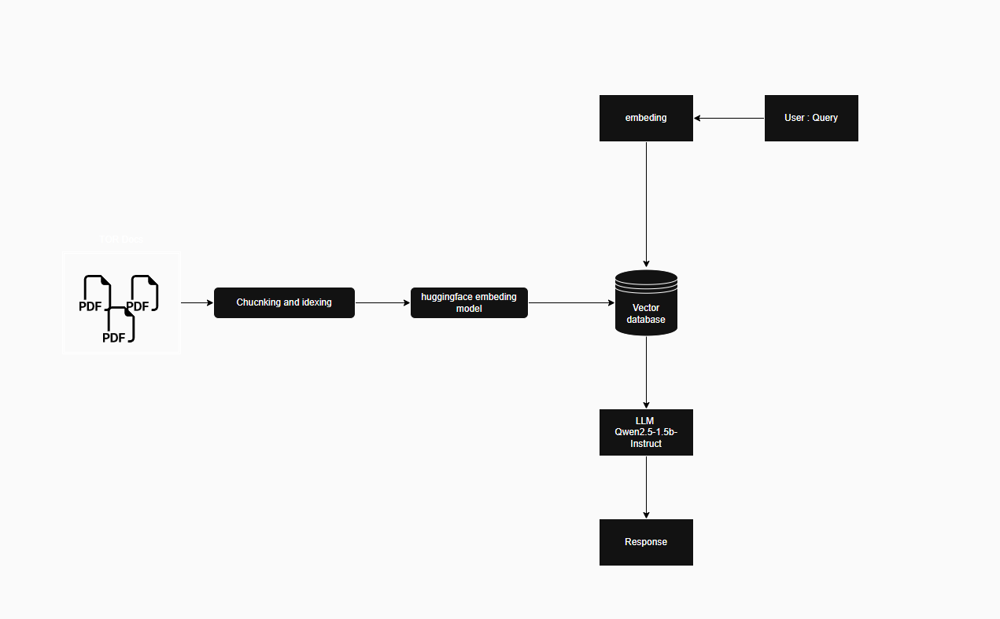

# TOR_chatbot
 Tor chatbot

## Concept Idea 
----------------------------

1. Ingest PDFs: Upload Thai TOR PDFs -> extract text with pdfplumber; auto OCR fallback (tha+eng) for scanned docs.

2. Chunk & Index: Split with RecursiveCharacterTextSplitter -> embed via intfloat/multilingual-e5-base -> store in FAISS .

3. Retrieve: User query is embedded and used to fetch top-k relevant chunks .

4. Generate: Qwen/Qwen2.5-1.5B-Instruct  answers in Thai using retrieved context; ConversationalRetrievalChain with chat memory.

## Dependencies 
----------------------------
1. Install the required dependencies:
```
pip install -r requirements.txt
```
2. Add the Huggingface token and add it to `.env` file 
```
HF_TOKEN=Your_hf_token
```
